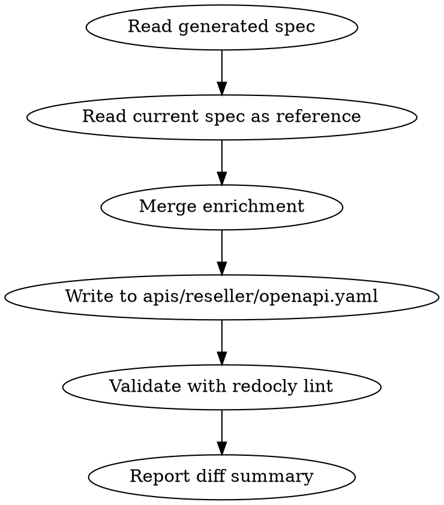

# Enrich Reseller API OpenAPI Spec

## Overview

Enriches a bare generated Reseller API OpenAPI spec with documentation metadata that the generation script doesn't produce: info block, servers, tag `x-displayName`s, tag descriptions, and per-endpoint `summary`/`description` fields.

## When to Use

- User provides a newly generated Reseller API OpenAPI spec (bare paths + schemas + tags + x-tagGroups)
- User asks to update/refresh the reseller spec from a generated source
- The generated spec is missing endpoint summaries, rich tag descriptions, or the info block

## Workflow



### 1. Read Both Specs

- **Generated spec**: provided by user (attachment or pasted)
- **Current enriched spec**: `apis/reseller/openapi.yaml` in the repo (source of truth for documentation content)

### 2. Merge Enrichment

Apply these layers from the current spec onto the generated spec:

#### a. Top-level metadata
- `openapi`: Set to `3.1.0`
- `info.title`: `Reseller API`
- `info.version`: `"1.0.0"`
- `info.contact`: name + email from current spec
- `info.description`: Full multi-section description from current spec (Feature Overview, Managed Solution, Payments, Contacts, Important Concepts, Operations, Domain Flags, Preview Mode, Get Access)
- `servers`: Production + Sandbox URLs from current spec

#### b. Tag enrichment
For each tag in the generated spec:
- Add `x-displayName` from current spec
- Replace short description with richer description from current spec

#### c. Endpoint enrichment
For each path+method in the generated spec:
- Match by `operationId` to the current spec
- Copy `summary` and `description` from current spec
- If a NEW endpoint exists (no match in current spec), write a concise `summary` (imperative, <10 words) and `description` (1-2 sentences explaining what it does and key parameters)

#### d. Preserve generated structure
- Keep ALL paths, schemas, security, x-tagGroups, and tag assignments from the generated spec (these are authoritative from the generation script)
- Only ADD documentation metadata; never remove or reorder endpoints

### 3. Write Output

Write the enriched spec to `apis/reseller/openapi.yaml`.

### 4. Validate

```bash
npx @redocly/cli lint apis/reseller/openapi.yaml
```

Fix any lint errors before finishing.

### 5. Report

Summarize what changed:
- New endpoints added (if any)
- Removed endpoints (if any)
- Endpoints with newly written summaries (no prior match)
- Any structural changes to tags or x-tagGroups

## Key Files

| File | Role |
|---|---|
| `apis/reseller/openapi.yaml` | Enriched spec (output + reference) |
| `redocly.yaml` | Redocly config (has `reseller-v1@main` entry) |
| `apis/sidebars.yaml` | API sidebar nav |
| `apis/overview.md` | API overview page |

## Common Mistakes

- **Reordering endpoints**: Keep the path order from the generated spec
- **Overwriting tag assignments**: The generated spec's tags are authoritative; only add `x-displayName` and richer descriptions
- **Missing new endpoints**: Always diff operationIds between generated and current to catch additions/removals
- **Forgetting servers block**: The generated spec typically has `servers: []`; always populate from current
