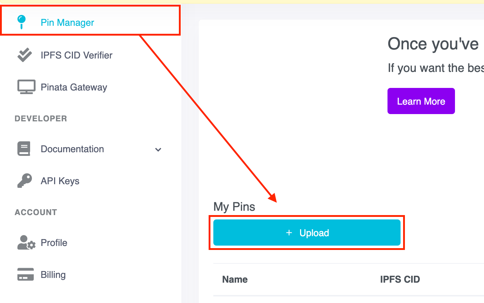
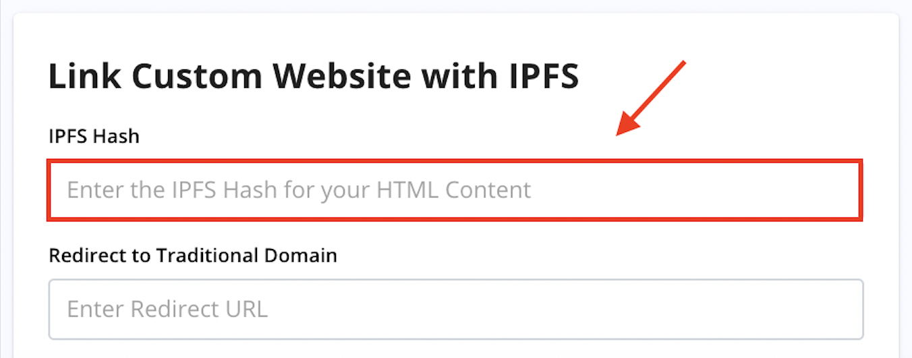

# Connecting Your D-Website to Your Domain

UD provides two broader options for connecting your decentralized website to your domain:

1. [Use our IPFS uploader](#step-2a-upload-your-static-website-files-to-our-ipfs-uploader) to upload your static website (limited to 20MB per domain).
2. [Manually upload your static website to IPFS](#step-2b-manually-upload-your-website-to-ipfs) and [attach the resulting IPFS hash to your domain](#step-3-connect-your-ipfs-site-to-your-domain).

The following flow chart outlines the process for purchasing a domain and connecting a decentralized website.

.png>)

You can also view the [IPFS Youtube Video](https://youtu.be/I9vTeAtELOk) for a quick overview of building a decentralized website and attaching the IPFS hash to your domain.

## Step 1: Build Your Static Website

Hosting a d-website on IPFS is slightly different from hosting it on a centralized web server and you will need to ensure that your websitex is properly configured for the IPFS network. All IPFS websites must adhere to the following constraints:

* All of the content for your website is contained in **one** directory, with an `index.html` file at the top level.
* All links within your source files are relative links.

You can build your static website using any tool or platform, as long as its output meets these requirements. Here are a few options for creating your static site:

* Static website generators such as [Mobirise](http://mobirise.com) and [GoHugo](https://gohugo.io)
* Convert a Wordpress site to a static site, with plugins like [Simply Static](https://wordpress.org/plugins/simply-static). For more information on this plugin see our support solution, [Wordpress to IPFS](https://support.unstoppabledomains.com/support/solutions/articles/48001188127-wordpress-to-ipfs).

* [UD and IPFS Community templates](using-a-template.md)

## Step 2a: Upload Your Static Website Files to our IPFS Uploader

* Go to **My Domains**
* Select **Manage** next to the domain you want to use
* Select the **Website** tab


* Upload your files to the **IPFS Uploader** and **Save Changes**


:::info
For websites that exceed the 20MB file limit, we recommend using a dedicated pinning service, such as [Pinata](https://pinata.cloud) or [Temporal](https://temporal.cloud).
:::

:::success
**Congratulations!** You just connected your d-website to your Unstoppable Domain.
:::

## Step 2b: Manually Upload Your Website to IPFS

If you decide not to use the UD IPFS Uploader, you will need to upload the site yourself and get the resulting IPFS hash. There are many options for doing this.

### IPFS Deploy

[IPFS Deploy](https://github.com/ipfs-shipyard/ipfs-deploy) is a zero-config CLI designed specifically for deploying a static website to IPFS. Pinning service configuration options include Infura, DAppNode, IPFS Cluster, and Pinata.

For more information on this tool for deploying d-websites, please review the [IPFS Deploy README](https://github.com/ipfs-shipyard/ipfs-deploy#readme) file.

### Upload Directly to IPFS (GitHub Action)

There is a [GitHub Action](https://github.com/marketplace/actions/upload-to-ipfs) which allows you to upload a D-website directly to IPFS.

Input parameters:

| Parameter     | Required | Service | Description                                                                                |
| ------------- | -------- | ------- | ------------------------------------------------------------------------------------------ |
| path          | Yes      |         | Directory’s path to upload.                                                                |
| service       | No       |         | Type of target service to upload. Supported services \[ipfs, pinata, infura]. Default ipfs |
| timeout       | No       |         | Request timeout. Default 60000 (1 minute)                                                  |
| verbose       | No       |         | Level of verbosity \[false - quiet, true - verbose]. Default false                         |
| host          | No       | ipfs    | IPFS host. Default ipfs.komputing.org                                                      |
| port          | No       | ipfs    | IPFS host’s port. Default 443                                                              |
| protocol      | No       | ipfs    | IPFS host’s protocol. Default https                                                        |
| pinataKey     | Yes\*    | pinata  | Pinata Api Key. Required for pinata service.                                               |
| pinataSecret  | Yes\*    | pinata  | Pinata Secret Api Key. Required for pinata service.                                        |
| pinataPinName | No       | pinata  | Human name for pin.                                                                        |

In order to use it, you need to add one step to main.yml:

```yaml
- uses: aquiladev/ipfs-action@v0.1.1
  id: upload
  with:
    path: ./build
```

There will be a build artifact on a runner after [steps](https://dapps-delivery-guide.readthedocs.io/en/latest/delivery/github-actions.html#step-1-create-pipeline) (usually in directory build or dist). You need to pass the directory as a path parameter.

This step will have hash output — it will be needed later to [add the IPFS hash to your domain](#step-3-connect-your-ipfs-site-to-your-domain). Token **${{ steps.upload.outputs.hash }}** can be used in next steps where _upload_ is the id of current step.

### Upload to Pinata using GitHub Action

The same GitHub Action allows you to upload a D-website to [Pinata](https://pinata.cloud) pinning service. Pinata simplifies immutable data with a simple IPFS API and toolkit.

In order to use it, you need to add one step to main.yml:

```yaml
- uses: aquiladev/ipfs-action@v0.1.3
  id: pinata
  with:
    path: ./build
    service: pinata
    pinataKey: ${{ secrets.PINATA_KEY }}
    pinataSecret: ${{ secrets.PINATA_SECRET }}
    pinataPinName: {pin_name}
```

The output of the upload action is similar to the previous example. You will need to save the hash output to [add the IPFS hash to your domain](./#step-3-connect-your-ipfs-site-to-your-domain).

### Upload to Pinata.cloud Website Interface

You can also upload your static site to IPFS using the Pinata website.

* Go to [Pinata.cloud](https://pinata.cloud) and sign-up / sign-in.
* Ensure the **Pin Manager** tab is selected and click **Upload**.



* Then, click **Folder** and select the folder containing the website files you wish to upload.
* When the upload is complete, the IPFS CID (or **IPFS hash**) will appear under the Pin Manager tab.


* Click the IPFS hash to copy it to the clipboard. Then [add the IPFS hash to your domain](./#step-3-connect-your-ipfs-site-to-your-domain).


## Step 3: Connect Your IPFS Site to Your Domain

* Select **My Domains**
* Select **Manage** next to the domain you want to use
* Select the **Website** tab


* Add your **IPFS hash** to the respective field



:::success
**Congratulations!** You just connected your d-website to your Unstoppable Domain.
:::
