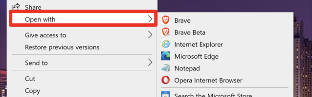

# Resolving Unstoppable D-Websites in a Browser

It will take some time for the IPFS website transaction to resolve on the blockchain after the transaction is signed with the user’s wallet. After the domain records are updated, the decentralized website will resolve in certain browsers and browser extensions.

## Compatible Browsers and Extensions

The following is a list of compatible browsers and extensions for Unstoppable d-websites:

* [Opera](https://unstoppabledomains.com/opera) for desktop and mobile (supports .crypto)
* [Brave](https://unstoppabledomains.com/brave\_pa) for desktop and mobile (supports .crypto)
* [Google Chrome Extension](https://chrome.google.com/webstore/detail/unstoppable-extension/beelkklmblgdljamcmoffgfbdddfpnnl?hl=en-US\&authuser=0) (supports all Unstoppable Top Level Domains)
* [Firefox Extension](https://addons.mozilla.org/en-US/firefox/addon/unstoppable-extension/) (supports all Unstoppable Top Level Domains)
* [Unstoppable Browser](https://unstoppabledomains.com/browser) (supports .crypto and .zil)

## Add a Custom DNS to Your Browser

:::info
These settings only allow your to resolve .crypto domains in your browser. To resolve .zil or other top level domains, you will either need the [browser extension](https://unstoppabledomains.com/extension) or the [Unstoppable Browser](https://unstoppabledomains.com/browser).
:::

The following table provides the configuration options for different browsers in order to view Unstoppable d-websites.

| Browser Type     | Configuration Settings                                                                                                                                                                                                                                                                                                                                                                                                                                                              |
| ---------------- | ----------------------------------------------------------------------------------------------------------------------------------------------------------------------------------------------------------------------------------------------------------------------------------------------------------------------------------------------------------------------------------------------------------------------------------------------------------------------------------- |
| Edge             | Browser Settings Menu > Privacy, search, and services > Security section and set Custom URL as [https://resolver.unstoppable.io/dns-query](https://resolver.unstoppable.io/dns-query)                                                                                                                                                                                                                                                                                               |
| Chrome           | Browser Settings Menu > Privacy and security > Security > Advanced section and set Custom URL as [https://resolver.unstoppable.io/dns-query](https://resolver.unstoppable.io/dns-query)                                                                                                                                                                                                                                                                                             |
| Firefox          | Browser Settings Menu > Options > General Tab > Network Settings > Settings section and set Custom URL as [https://resolver.unstoppable.io/dns-query](https://resolver.unstoppable.io/dns-query) and click OK.                                                                                                                                                                                                                                                                      |
| Brave            | <p>NOTE: Brave has <a href="https://support.unstoppabledomains.com/support/solutions/articles/48001188302-ultimate-user-guide#surfdweb">native support</a> for desktop and Android (iOS to follow). Follow these steps for other devices:</p><p></p><p>Browser Settings Menu > Additional settings > Privacy and security > Security > Advanced section and set Custom URL as <a href="https://resolver.unstoppable.io/dns-query">https://resolver.unstoppable.io/dns-query</a></p> |
| Opera            | <p></p><p>Opera Browser has <a href="https://unstoppabledomains.com/blog/opera-helloweb3">native support</a> for resolving .crypto domains across all platforms.</p>                                                                                                                                                                                                                                                                                                                |
| Android Phones   | For Android, follow the details for your browser as covered in the guidelines above.                                                                                                                                                                                                                                                                                                                                                                                                |
| iPhones & Safari | Download this [DNS profile](https://gist.github.com/mvwi/52b1f51786e95e791bc44c00ddeb4d85/raw/9315fc9172a7b2dd91dd849a8cb3bbe3295362a9/cloudflare-https.mobileconfig). Install the profile in Safari under Settings > General > Profile.                                                                                                                                                                                                                                            |

Once you have configured your browser according to this section, you will be able to access .crypto Unstoppable domains in two different ways:

1. `http://domainname.crypto`. note that it is `http` and **not** `https`
2. `domainname.crypto/`, using a **forward slash** to override your browser's default search engine behavior.

:::info
If you have the Unstoppable extension in your browser you will need to disable it to switch to DNS over https (which retains the domain name in the browser).
:::

## Resolve Using a Gateway URL

You can also resolve a decentralized website using a gateway URL, such as the ones provided by [Blockscan](http://blockscan.com) or [Pinata](https://docs.pinata.cloud/gateways/dedicated-gateways).&#x20;

IPFS gateways provide workarounds for applications that do not yet support IPFS natively, which allows those browsers and tools to access IPFS content. See the resource guide on [IPFS Gateways](https://docs.ipfs.io/concepts/ipfs-gateway/#overview) for more information.

## **Redirect to a Traditional DNS Record with an Unstoppable Domain**

In order to set up a redirection to a traditional domain, you will need to do a redirection via index.html on your blockchain domain so users are sent to a traditional domain.&#x20;

1. On your computer, open a text editor (for example: Notepad for Windows or TextEdit for Mac) and paste the following code into an empty file.

    ```html
    <!DOCTYPE html>
    <html>
    <head>
    <title>HTML Meta Tag</title>
    <meta http-equiv = "refresh" content = "1; url = YOUR WEBSITE URL HERE" />
    </head>
    <body>
    <p>YOUR WEBSITE DESCRIPTION HERE </p>
    </body>
    </html>
    ```

2. Replace `YOUR WEBSITE HERE` with your website URL and `YOUR WEBSITE DESCRIPTION HERE` with a short description of your website and save the file as `index.html` (**do not use any other name**).

3. Open `index.html` from your hard drive to see if everything is working before proceeding. Right-click the file and select "**Open with**" followed by your browser of choice.

    

3. Follow steps 2 and 3 of [Connecting a D-Website to Your Domain](connecting-a-dwebsite.md) to upload your redirect `index.html` to IPFS and attach it to your domain.
