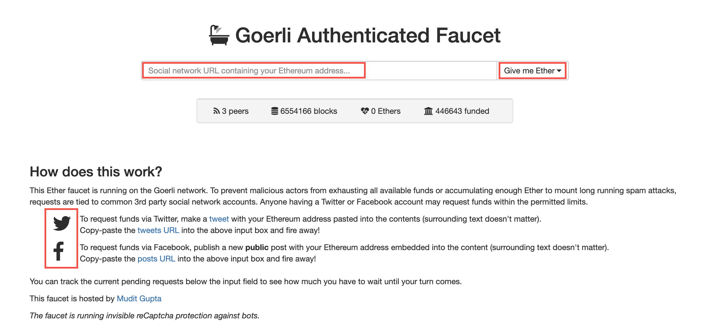

# Get a Free Ethereum Test Domain

**[[insert overview, reusable content]]**

:::info
[Goerli faucet](https://goerli-faucet.slock.it/) offers free money in the form of Ether tokens for domains minted on Goerli Testnet.
:::

## Step 1: Check Wallet Compatibility for Etherscan

* Check that you have a wallet compatible with [WalletConnect](https://walletconnect.org/wallets) (e.g. [Trust Wallet](https://trustwallet.com), [MetaMask](https://metamask.io)).
* Ensure you have enough Ether on your Ethereum wallet to pay transaction fees, if you are not planning to use Goerli Testnet.

:::info
To calculate the transaction fee you'd like to target you can use services like [ETH Gas Station](https://ethgasstation.info/calculatorTxV.php). The average transaction gas usage to mint and transfer a new domains is around 180,000 gas.
:::

## Step 2. Get free Ether from Goerli Faucet

* Go to Faucet Page: [https://goerli-faucet.mudit.blog](https://goerli-faucet.mudit.blog).
* Make a Twitter or Facebook post with your Ethereum address pasted anywhere in the contents of the post.
* Copy/paste the URL of the post to Goerli faucet to verify your identity.
* Click the **Give Me Ether** button.

## Step 3: Open the Etherscan Smart Contract Request

* Open the domain request Smart Contract using [Etherscan](https://etherscan.io/address/0x1fC985cAc641ED5846b631f96F35d9b48Bc3b834#writeContract).
* To get a test domain on testnet, find the Smart Contract address in [reference table](domain-registry-essentials/cns-smart-contracts.md#freeminter).
* Connect your wallet.

## Step 4: Write the Etherscan Smart Contract Request

* Enter the **suffix** for the domain in the claim -> label (string) field.
* &#x20;Press the **Write** button to start the transaction.

* Sign the transaction.

:::danger
If a transaction takes more gas than expected (more than 200,000 gas to call the claim method) or fails, that domain name may be already claimed. Double check that it's available and [contact us](https://discord.gg/b6ZVxSZ9Hn) if you continue to have problems.&#x20;
:::

:::success
Congratulations! You're the new proud owner of a test domain on Etherscan. Happy hacking!
:::
