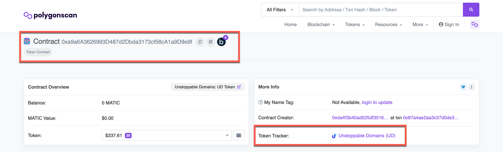
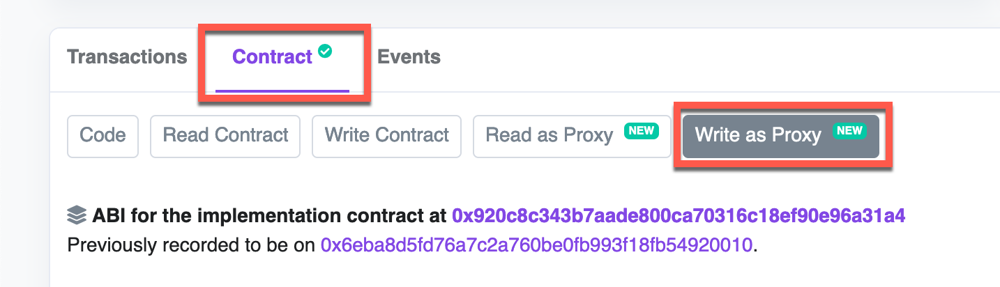
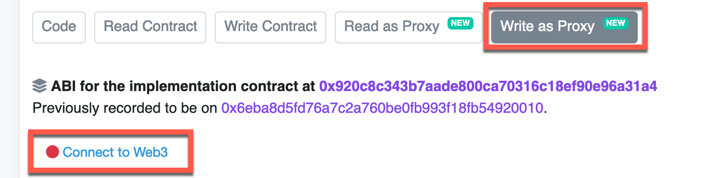
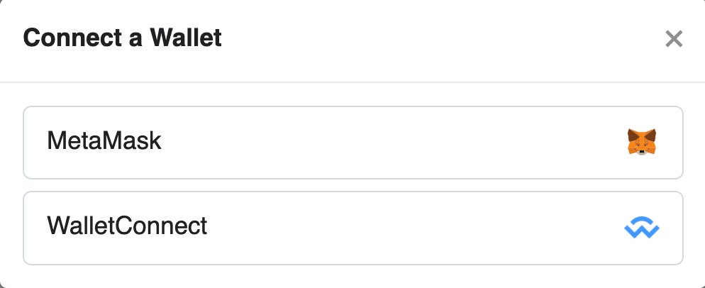
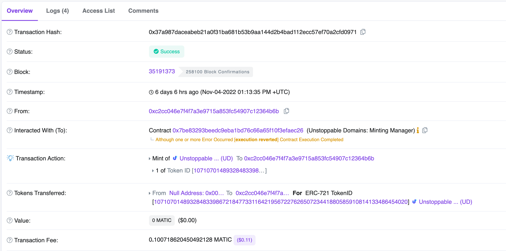

# Mint Subdomains Using Smart Contracts

This guide covers how to mint UD subdomains using proxy contracts. This process requires using the Etherscan and Polygonscan user interface to write and execute proxy contracts.

## Step 1: Select a UNS Registry Smart Contract

The [UNS Registry](/developer-toolkit/reference/smart-contracts/uns-smart-contracts.md#unsregistry) contract is where domain owners store their data and is a map of domain namehashes to key-value dictionaries of records. Choose one of the Unstoppable Registry smart contracts to interact with (either mainnet or testnet).

<figure>

<figcaption>polygon registry contract</figcaption>
</figure>

## Step 2: Open the "Write as Proxy" Tab for the Registry Contract

Navigate to the `Contract` tab in either the Etherscan or Polygonscan page of the Registry contract and click on the `Write as Proxy` tab:

<figure>

<figcaption>polygonscan write as proxy tab</figcaption>
</figure>

## Step 3: Connect Your Web3 Wallet

Click on the `Connect to Web3` button in the `Write as Proxy` tab and connect the wallet associated with the domain:

<figure class="half-inline-block">

<figcaption>polygonscan connect wallet</figcaption>
</figure>

<figure class="half-inline-block">

<figcaption>wallet provider list</figcaption>
</figure>

## Step 4: Mint the Subdomain

Choose the `mintWithRecords()` method from the `Write as Proxy` tab section. The method allows you to mint subdomains of domains you already own to your wallet address.

<figure>

<figcaption>polygonscan mintWithRecords method</figcaption>
</figure>

Next, add your wallet address that owns the root domain to the `to` field and the subdomain you want to mint to the `labels` field. For example, if you own the `example.crypto` domain with your wallet address as `0xC37d3c4326ab0E1D2b9D8b916bBdf5715f780fcF` and you want to mint `blog.example.crypto`, you will fill the parameters like so:

<figure>

<figcaption>filling mintWithRecords parameters</figcaption>
</figure>

Then, add the record(s) you want pre-filled in the subdomain after minting to the `keys` and `values` fields as an array of values. See the [Records Reference](/developer-toolkit/reference/records-reference.md) documentation for supported values. You can also provide empty records if you wish to.

<figure>

<figcaption>filling mintWithRecords parameters</figcaption>
</figure>

## Step 5: Execute the Contract

Click the `Write` button to sign the transaction and execute the contract. After signing the transaction, you can view its details on the blockchain explorer, like so:

<figure>

<figcaption>polygonscan transaction details</figcaption>
</figure>

:::success Congratulations!
You have successfully minted a subdomain using smart contracts. Happy hacking!
:::
