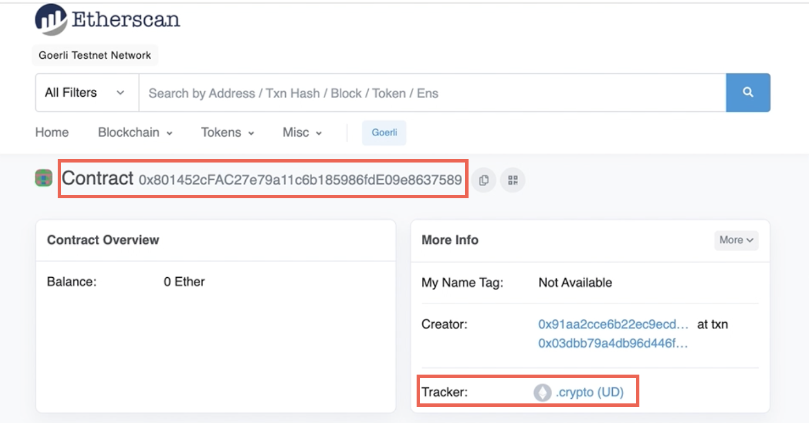
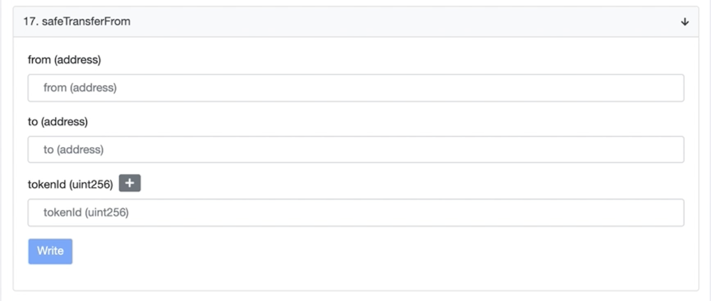

# CNS L1 to UNS L1: Domain Transfer Guide

This guide covers two options for transferring from CNS Layer 1 to UNS Layer 1. Both options call the safeTransferFrom function, but the second option passes the '''_data parameter''' of abi.encode(['bool'], [false]). See Step 3 for details on the safeTransferFrom domain transfer options.

# Prerequisites
* Token ID of minted domain on Layer 1 (Ethereum)
* Owner’s wallet address
​[CNS Layer 1 Contract](https://goerli.etherscan.io/address/0x801452cFAC27e79a11c6b185986fdE09e8637589) on Etherscan
​[UNS Layer 1 Contract](https://goerli.etherscan.io/address/0x070e83FCed225184E67c86302493ffFCDB953f71) on Etherscan
abiCoder.encode(['bool'], [false]) = '''0x0000000000000000000000000000000000000000000000000000000000000000'''

:::attention 
The abiCoder.encodepre-requisite is only needed for the second migration option, which uses the false boolean abider.encode parameter.
:::

# Step 1: Verify Contract Info for Each Registry
* Open the [CNS Layer 1 Contract](https://goerli.etherscan.io/address/0x801452cFAC27e79a11c6b185986fdE09e8637589) page 
* Open the [UNS Layer 1 Contract](https://goerli.etherscan.io/address/0x070e83FCed225184E67c86302493ffFCDB953f71) page 
* Verify that you’ve opened the correct contracts by checking the Contract address (top of the page) and tracker field (right side of page). 

## For CNS Layer 1
* the contract address should be '''0x801452cFAC27e79a11c6b185986fdE09e8637589'''
* the tracker should say .crypto (UD)

## For UNS Layer 1
* the contract address should be '''0x070e83FCed225184E67c86302493ffFCDB953f71'''
* the tracker info should say Unstoppable Domains (UD)

## Step 2: Verify Domain Ownership on CNS L1
* Retrieve the token ID of the domain you want to transfer.
* On the [CNS Layer 1 Contract](https://goerli.etherscan.io/address/0x801452cFAC27e79a11c6b185986fdE09e8637589) page, select **Contract -> Read Contract ->** and scroll down to complete the **OwnerOf** function.
* Paste the **token ID** into the ‘ownerOf’ field.
* Select the **Query** button to check the ownership and confirm the location of the domain.
* Verify the **wallet address** returned by the OwnerOf query to ensure it is an exact match to your wallet address.

:::attention
You will receive the owner’s wallet address in response to the ownerOfquery if the domain is located on the CNS registry. Otherwise, you will receive the ER721 error: "owner query for nonexistent token.”
:::

## Step 3: Select a safeTransferFrom Option
Before writing the contract, you must select a '''safeTransferFrom''' Option. Both of the safeTransferFrom options operate the same way on the backend, so it doesn’t matter which option is selected as long as all parameters are correctly entered.

### OPTION 1: safeTransferFrom function with three fields
* Complete the three '''safeTransferFrom''' fields: from, to, tokenId.
    * from (address): Enter the owner’s wallet address 
    * to (address): Enter the UNS Layer 1 contract address
    * tokenId: Enter the tokenId of the domain you want to rewrite to the UNS registry (i.e., the same tokenID that you verified in Step 2 above)

### OPTION 2: safeTransferFrom function with four fields
* Complete the four '''safeTransferFrom''' fields: from, to, tokenId, _data.
    * from (address): Enter the owner’s wallet address 
    * to (address): Enter the UNS Layer 1 contract address
    * tokenId: Enter the tokenId of the domain you want to rewrite to the UNS registry (i.e., the same tokenID that you verified in Step 2 above)
    * _data: enter the false boolean parameter required for this function, '''0x0000000000000000000000000000000000000000000000000000000000000000'''

## Step 4: Rewrite the Domain to UNS L1 Registry
* At the top of the [CNS Layer 1 Contract](https://goerli.etherscan.io/address/0x801452cFAC27e79a11c6b185986fdE09e8637589) page, select **Contract -> Write Contract -> Connect to Web3** to connect your wallet.
* Then, select **Contract -> Write Contract** -> and scroll down to complete one of the '''safeTransferFrom''' options selected from [Step 3](#step-3-select-a-safetransferfrom-option).

* Select the **Write** button to rewrite or transfer the domain to the UNS Layer 1 registry.

:::attention
If the ‘write’ button is grayed out, then scroll to the top of the page and select the Connect to Web3 button. Then, return to this section to write the contract.
:::

* **Sign the transaction** with your wallet address.
* Click the **View your transaction** button to verify the transaction, such as status, from, to, and tokens transferred fields.

## Step 5: Verify Domain Transfer to UNS L1
:::attention
It is recommended that you double-check the transaction status by verifying domain ownership on the UNS Registry.
:::

* On the [UNS Layer 1 Contract](https://goerli.etherscan.io/address/0x070e83FCed225184E67c86302493ffFCDB953f71) page, select **Contract -> Read as Proxy** -> and scroll down to complete the **OwnerOf** function.
* Verify domain transfer to UNS L1 using **Contract -> Read as Proxy**
* Paste the **token ID** into the ‘ownerOf’ field.
* Select the **Query** button to check the ownership and confirm the location of the domain.
* Verify the **wallet address** returned by the '''OwnerOf''' query to ensure it is an exact match to your wallet address. If your wallet address is showing, then it means that your domain transferred successfully from CNS Layer 1 over to UNS Layer 1.

:::success
Congratulations! You just migrated your domain from CNS L1 to UNS L1!
:::