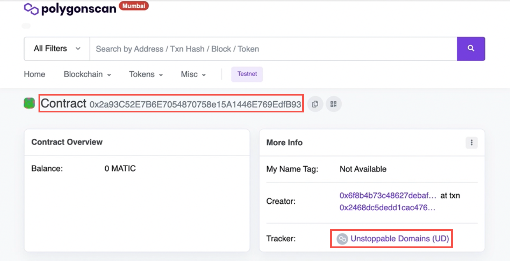
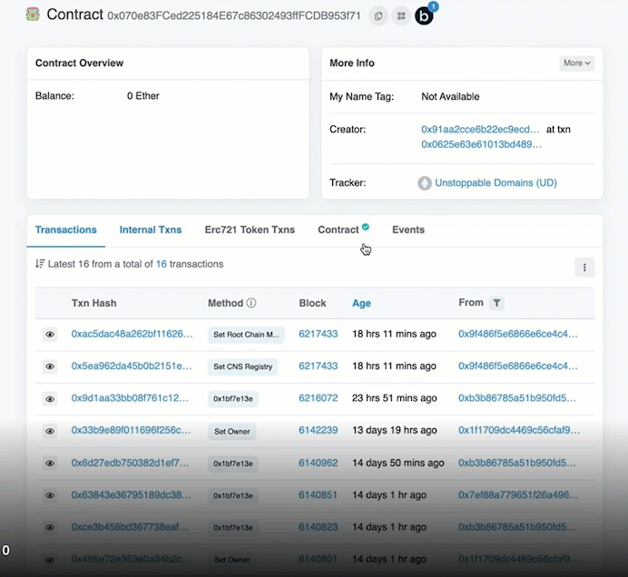

# UNS L1 to UNS L2: Domain Deposit Guide

This guide covers the process for depositing a domain from UNS Layer 1 to UNS Layer 2. This process requires use of the ```depositToPolygon(uint256)``` function. 

# Prerequisites
* Token ID of minted domain on Layer 1 (Ethereum)
* Owner’s wallet address
* ​[UNS Layer 1 Contract](https://goerli.etherscan.io/address/0x070e83FCed225184E67c86302493ffFCDB953f71) on Etherscan
* [UNS Layer 2 Contract](https://mumbai.polygonscan.com/address/0x2a93C52E7B6E7054870758e15A1446E769EdfB93) on Polygonscan

# Step 1: Verify Contract Info for Each Registry 
* Open the [UNS Layer 1 Contract](https://goerli.etherscan.io/address/0x070e83FCed225184E67c86302493ffFCDB953f71) page 
* Open the [UNS Layer 2 Contract](https://mumbai.polygonscan.com/address/0x2a93C52E7B6E7054870758e15A1446E769EdfB93) page
* Verify that you’ve opened the correct contracts by checking the Contract address (top of the page) and tracker field (right side of page). 

## For UNS Layer 1
* contract address should be: ```0x070e83FCed225184E67c86302493ffFCDB953f71```
* tracker info should read: ```Unstoppable Domains (UD)```


## For UNS Layer 2
* contract address should be: ```0x2a93C52E7B6E7054870758e15A1446E769EdfB93```
* tracker info should read: ```Unstoppable Domains (UD)```



## Step 2: Verify Domain Ownership on UNS L1
* Retrieve the token ID of the domain you want to transfer.
* On the [UNS Layer 1 Contract](https://goerli.etherscan.io/address/0x070e83FCed225184E67c86302493ffFCDB953f71) page, select **Contract -> Read as Proxy ->** and scroll down to complete the **OwnerOf** function.
* Paste the **token ID** into the ‘ownerOf’ field.
* Select the **Query** button to check the ownership and confirm the location of the domain.
* Verify the **wallet address** returned by the OwnerOf query to ensure it is an exact match to your wallet address.

:::info
You will receive the owner’s wallet address in response to the ```ownerOfquery``` if the domain is located on the CNS registry. Otherwise, you will receive the ER721 error: "owner query for nonexistent token.”
:::



## Step 3: Rewrite the Domain to UNS Registry
* At the top of the [UNS Layer 1 Contract](https://goerli.etherscan.io/address/0x070e83FCed225184E67c86302493ffFCDB953f71) page, select **Contract -> Write Contract -> Connect to Web3** to connect your wallet.
* Then, select **Contract -> Write as Proxy** -> and scroll down to complete the second ```depositToPolygon``` function.


* Enter the **tokenID** of the domain you want to deposit to the UNS L2 registry (i.e., the same tokenID that you verified in Step 2 above).
* Select the **Write** button to rewrite or transfer the domain to the UNS registry.

:::info
If the ‘write’ button is grayed out, then scroll to the top of the page and select the Connect to Web3 button. Then, return to this section to write the contract.
:::

* **Sign the transaction** with your wallet address.
* Click the **View your transaction** button to verify the transaction, such as status, from, to, and tokens transferred fields.

## Step 4: Verify Domain Transfer to Custody Contract
:::info
It is recommended that you double-check the transaction status by verifying domain ownership on the UNS L1 Registry.
:::

* On the [UNS Layer 1 Contract](https://goerli.etherscan.io/address/0x070e83FCed225184E67c86302493ffFCDB953f71) page, select **Contract -> Read as Proxy** -> and scroll down to complete the **OwnerOf** function.


* Paste the **token ID** into the ‘ownerOf’ field.
* Select the **Query** button to check the ownership and confirm the location of the domain.
* Verify the wallet address returned by the ```OwnerOf``` query to ensure it matches the following predicate address: 

```javascript
"MintableERC721Predicate": {
    "address": "0x56E14C1748a818a5564D33cF774c59EB3eDF59",
    "legacyAddresses": [],
    "deploymentBlock": "0x2fc240"
},
```
:::info
When tokens are transferred to UNS L2, they will appear as owned by a custody contract called ```MintableERC721Predicate```. This process locks the contract for all tokens in the process of bridging to UNS L2.
:::

## Step 5: Verify Domain Bridging is Complete
* On the [UNS Layer 2 Contract](https://mumbai.polygonscan.com/address/0x2a93C52E7B6E7054870758e15A1446E769EdfB93) page, select **Contract -> Read as Proxy** -> and scroll down to complete the ```OwnerOf``` function.
* Paste the **token ID** into the ‘ownerOf’ field.
* Select the **Query** button to check the ownership and confirm the location of the domain.
* Verify the **wallet address** returned by the OwnerOf query to ensure it matches your wallet address. If your wallet address is showing, then it means that your domain was successfully deposited on UNS Layer 2.

:::success
Congratulations! You just deposited your domain from UNS L1 to UNS L2!
:::